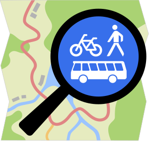
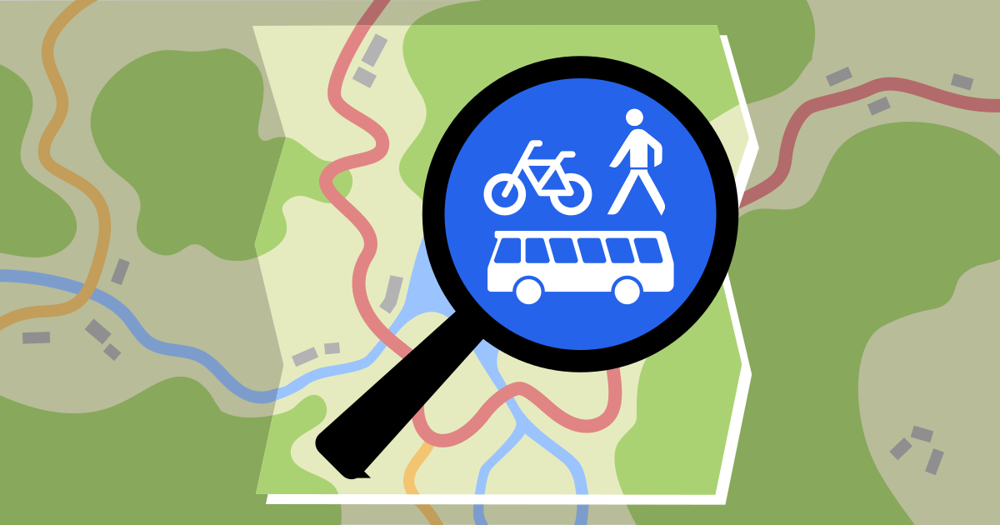
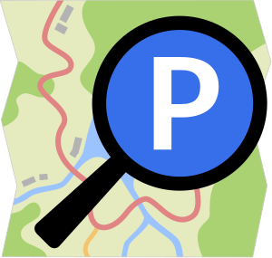
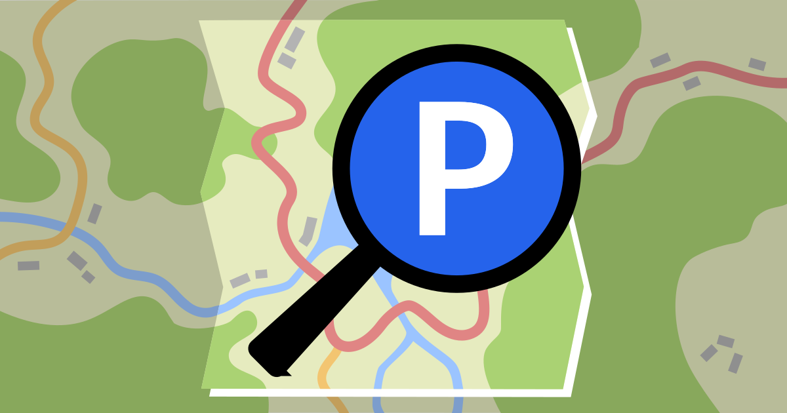
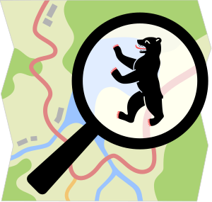
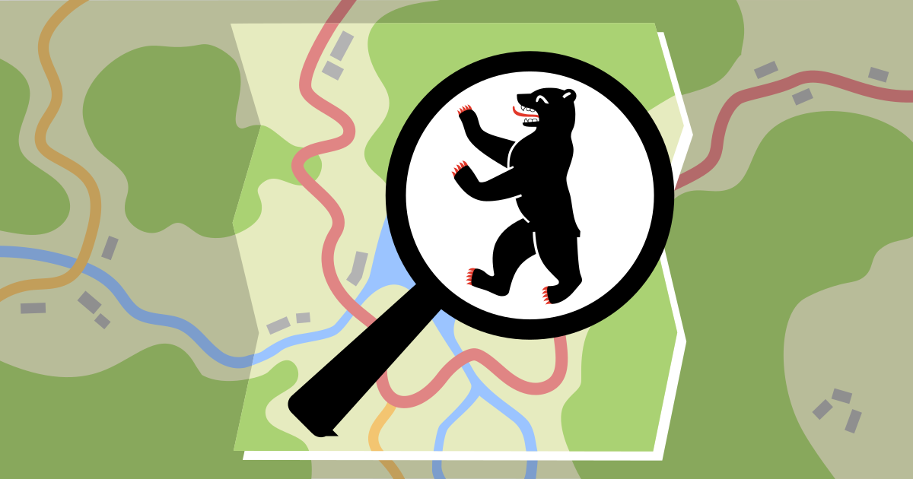
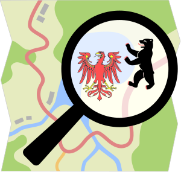
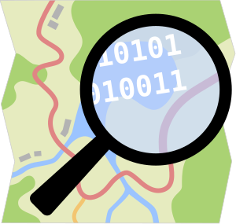
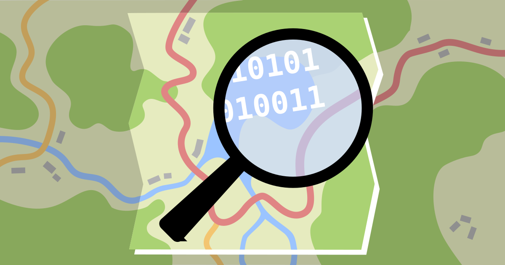

# OpenStreetMap Community Logo Design System

## A new Logo for OSM Community Projects

In the winter 2024/2025, I ([@tordans](https://www.openstreetmap.org/user/tordans)) had the opportunity to [work on the OSM traffic sign project with funding from Prototype Fund](https://www.osm-verkehrswende.org/traffic-signs/). As part of this project, I was able to take some time and get support to work on a new Logo for the project.

We first looked at the OSM projects that are related to the traffic sign project like the [OSM Parking Data Project](https://parkraum.osm-verkehrswende.org/), the [OSM Verkehrswende Community](https://www.osm-verkehrswende.org/) and the [OSM Berlin-Brandenburg Meetup](https://wiki.openstreetmap.org/wiki/Berlin/Stammtisch). Those projects all use the official OSM Logo and customize them in a sub brand fashion to make them unique.

We took this opportunity to see, if we can improve this system. Our design goals where…

- Stay very close to the original, [official OSM Logo](https://wiki.openstreetmap.org/wiki/File:Public-images-osm_logo.svg)

- Simplify the logo shape and details to make them work better when they are small

- Keep the sub branding aspect that allows to easily create new logos by changing the content of the magnifying glass

When we looked into the details of the official OSM logo, we took the opportunity to optimize some aspects that we thing can be improved: Simplify the outer shape. Simplify the magnifying glass. And change the content of the map to represent more of OSM by showing streets, buildings and landuse – instead of borders and contour lines.

### Updated community logos

The new logo still looks like the OSM logo we know but in a more modern style and easy to customize for community projects.

Below are our updated community projects logos – together with an example of what the classic OSM logo would look like based on this design system.

### Updated social sharing images

To fit nicely with this logo update, we also updated our social sharing images which make it easy to have a custom look for a project without much effort.

### Use it for your projects

Feel free to use the logos and customize the for you communit projects. For use on the web, I recommend to run the logos through

PS: And what about the traffic sign project? In the end we decided to go a different route [for that project](https://trafficsigns.osm-verkehrswende.org/) and focus more on the sign part than the OSM part.

## List

| Project                           | Logo                                                                                                                                                                                                                                      | Social Sharing                                                                                                                                                             |
| --------------------------------- | ----------------------------------------------------------------------------------------------------------------------------------------------------------------------------------------------------------------------------------------- | -------------------------------------------------------------------------------------------------------------------------------------------------------------------------- |
| **OSM Verkehrswende Community**   |  [Wiki](https://wiki.openstreetmap.org/wiki/File:OSMVBerlin.svg) / [SVG](./files/osm-verkehrswende-logo-2025.svg) / [PNG](./files/osm-verkehrswende-logo-2025.png)                            |  [SVG](./files/social-sharing-osm-verkehrswende-2025.svg) / [PNG](./files/social-sharing-osm-verkehrswende-2025.png) |
| **OSM Parkraum Project**          |  [Wiki](https://wiki.openstreetmap.org/wiki/File:Osm-parkraum-logo-2025.svg) / [SVG](./files/osm-parkraum-logo-2025.svg) / [PNG](./files/osm-parkraum-logo-2025.png)                               |  [SVG](./files/social-sharing-osm-parkraum-2025.svg) / [PNG](./files/social-sharing-osm-parkraum-2025.png)                |
| **OSM Berlin Community**          |  [Wiki](https://wiki.openstreetmap.org/wiki/File:Logo_Berlin.svg) / [SVG](./files/osm-berlin-logo-2025.svg) / [PNG](./files/osm-berlin-logo-2025.png)                                                |  [SVG](./files/social-sharing-osm-berlin-2025.svg) / [PNG](./files/social-sharing-osm-berlin-2025.png)                      |
| **OSM Berlin-Brandenburg Meetup** |  [Wiki](https://wiki.openstreetmap.org/wiki/File:Logo_BerlinBrandenburg.svg) / [SVG](./files/osm-berlin-brandenburg-2025.svg) / [PNG](./files/osm-berlin-brandenburg-2025.png)                |                                                                                                                                                                            |
| **OpenStreetMap Logo Example**    |  [Wiki](https://wiki.openstreetmap.org/wiki/File:Osm-openstreetmap-community-logo-2025.svg) / [SVG](./files/osm-openstreetmap-logo-2025.svg) / [PNG](./files/osm-openstreetmap-logo-2025.png) |  [SVG](./files/social-sharing-openstreetmap-2025.svg) / [PNG](./files/social-sharing-openstreetmap-2025.png)             |

## Editing

- You can use [Inkscape](https://inkscape.org/release/) to edit the logo
- I recommend processing the result with [SVGO](https://jakearchibald.github.io/svgomg/) to clean it up for the web (use Setting 'Prefer viewBox')

## License

[CC-0](/LICENSE)
